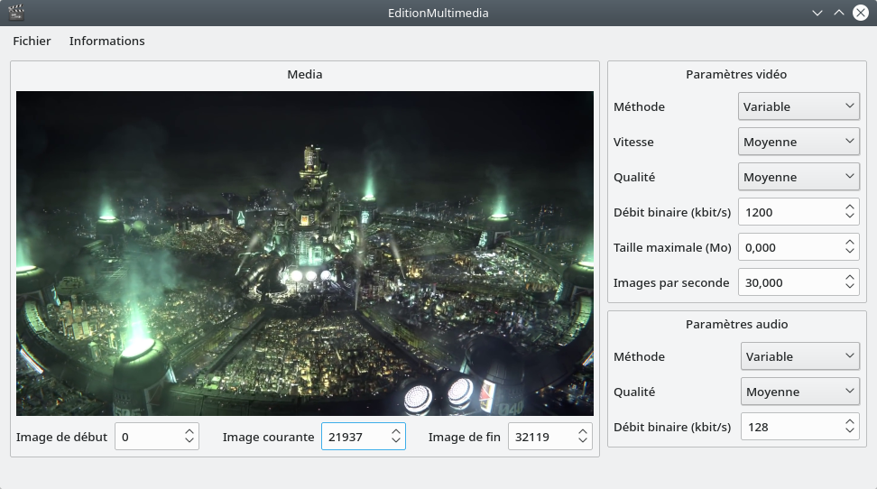

# EditionMultimedia

EditionMultimedia est une application graphique permettant l'édition de fichiers multimedia.

Les fonctionnalités principales de l'application sont les suivantes :

 - Sélection d'un fichier multimedia,
 - Définition visuelle du segment à considérer,
 - Définition des paramètres d'encodage vidéo (qualité, débit binaire ou taille maximale),
 - Définition des paramètres d'encodage audio (qualité ou débit binaire),
 - Réencodage du fichier multimedia,
 - Chargement et sauvegarde d'une édition de fichier multimedia.

L'application est réalisée en C++11 et [Qt 4.8.7](https://download.qt.io/archive/qt/4.8/4.8.7/) et nécessite l'application [FFmpeg 4.1.3](https://ffmpeg.org/download.html).

